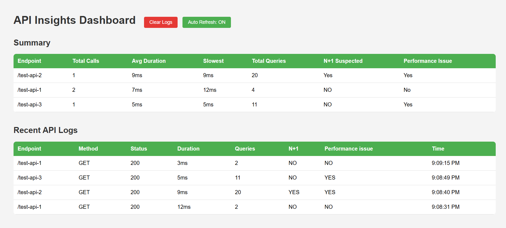

# spring-boot-insights

[](https://opensource.org/licenses/MIT)
[](https://central.sonatype.com/artifact/io.github.nishithsai00/spring-boot-insights)
[](https://central.sonatype.com/artifact/io.github.nishithsai00/spring-boot-insights)

Zero-config API monitoring for Spring Boot 3.x. Drop it in and immediately get request duration tracking, query count per request, N+1 detection, and a live dashboard — no agents, no external services, no setup.

---

## What it does

Every HTTP request that hits your app is automatically intercepted. The library measures how long it took, how many SQL queries Hibernate fired during that request, whether those queries look like an N+1 pattern, and whether the query count crossed your performance threshold. All of this is available via REST endpoints and a built-in dashboard — in memory, no extra infrastructure needed.

---

## Installation

```xml
<dependency>
    <groupId>io.github.nishithsai00</groupId>
    <artifactId>spring-boot-insights</artifactId>
    <version>1.0.2</version>
</dependency>
```

That's it. Auto-configuration handles everything else. No `@EnableInsights`, no beans to define.

**Requirements:** Spring Boot 3.x · Java 17+ · Hibernate (spring-boot-starter-data-jpa)

---

## Dashboard

Once running, open:

```
http://localhost:8080/dashboard.html
```

You'll see two tables — a summary grouped by endpoint (avg duration, slowest call, total queries, N+1 flag, performance flag) and a live log of recent requests in reverse chronological order. The dashboard auto-refreshes every 5 seconds; you can toggle that off if needed.



---

## REST Endpoints

| Endpoint | Method | Description |
|---|---|---|
| `/insights` | GET | Raw log of every tracked request |
| `/insights/summary` | GET | Aggregated stats grouped by endpoint |
| `/insights/clear` | DELETE | Clears all in-memory logs |
| `/dashboard.html` | GET | Browser dashboard |

**Sample `/insights/summary` response:**

```json
{
  "/api/orders": {
    "Count": 42,
    "Slowest": "834ms",
    "Average": "210ms",
    "QueriesFired": 189,
    "isN+1 Suspected": "Yes",
    "PerformanceWarning": "Yes"
  }
}
```

---

## How detection works

**Query counting** is done via Hibernate's `StatementInspector`. Every SQL statement Hibernate executes is counted per-thread using a `ThreadLocal` counter — no proxying, no datasource wrapping.

**N+1 detection** — after each request completes, the library groups identical SQL statements and checks if any single query was repeated ≥ 3 times in that request. If so, the request is flagged as a suspected N+1. The threshold defaults to 3.

**Performance warning** — if the total number of SQL queries fired during a single request exceeds 10, a performance warning is attached to that log entry. The threshold defaults to 10.

Both thresholds are intentionally conservative and adjustable (see below).

---

## Adjusting detection thresholds

The defaults work well for most CRUD apps, but if you have endpoints that legitimately fire more queries (batch operations, report generation, etc.) you can tune them at startup:

```java
@SpringBootApplication
public class YourApplication {
    public static void main(String[] args) {
        // Raise N+1 threshold — only flag if the same query repeats 5+ times
        RunTimeInterceptor.setnPlusOneSuspected(5);

        // Raise performance threshold — warn only after 25 queries per request
        RunTimeInterceptor.setPerformanceWarningLimit(25);

        SpringApplication.run(YourApplication.class, args);
    }
}
```

| Setter | Default | What it controls |
|---|---|---|
| `RunTimeInterceptor.setnPlusOneSuspected(int)` | `3` | Minimum repeat count of an identical query to flag N+1 |
| `RunTimeInterceptor.setPerformanceWarningLimit(int)` | `10` | Max total queries per request before flagging performance |

---

## Disabling the library

To turn off all monitoring without removing the dependency:

```properties
# application.properties
insights.enabled=false
```

When set to `false`, none of the beans are registered — no interceptor, no controller, no dashboard. The property defaults to `true`, so omitting it keeps monitoring active.

---

## Spring Security

If your app uses Spring Security, the four library endpoints need to be permitted explicitly. Add them to your security config:

```java
@Bean
public SecurityFilterChain filterChain(HttpSecurity http) throws Exception {
    http.authorizeHttpRequests(auth -> auth
        .requestMatchers(
            "/insights",
            "/insights/summary",
            "/insights/clear",
            "/dashboard.html"
        ).permitAll()
        // ... rest of your rules
        .anyRequest().authenticated()
    );
    return http.build();
}
```

---

## What's stored and how long

Everything is kept in a plain `ArrayList` in memory — there's no database, no file writes, nothing persists across restarts. This is intentional: the library is a development and debugging aid, not a metrics store. Call `DELETE /insights/clear` or restart the app to wipe the data. For production-grade retention, ship your logs to your existing observability stack.

---

## Limitations worth knowing

- **In-memory only.** Logs are lost on restart. Not designed as a replacement for Prometheus, Micrometer, or APM tools.
- **Single-node only.** No aggregation across instances — each node tracks its own requests.
- **Hibernate only.** Query counting relies on Hibernate's `StatementInspector`. If you're using JDBC templates directly or a different ORM, queries won't be counted.
- **No auth on insights endpoints.** If you're deploying this to an environment where the port is exposed, use Spring Security to lock these down.

---

## License

MIT

---

Developed by [Nishith Sai](mailto:nishithsai123@gmail.com) · [LinkedIn](https://www.linkedin.com/in/nishith-sai-62a60b378)